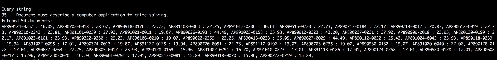

# A search engine built over Tf-Idf model

## Code design

1. Parsing
1. Indexing

## Steps to run the program:

* Compile the program: 

`mvn compile`

* Run Indexer and Query: 

`mvn exec:java -Dexec.mainClass="fayeoyaee.Indexer"`

* Query result example:

